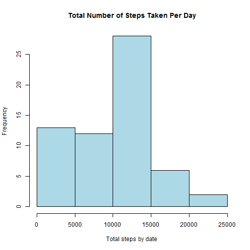
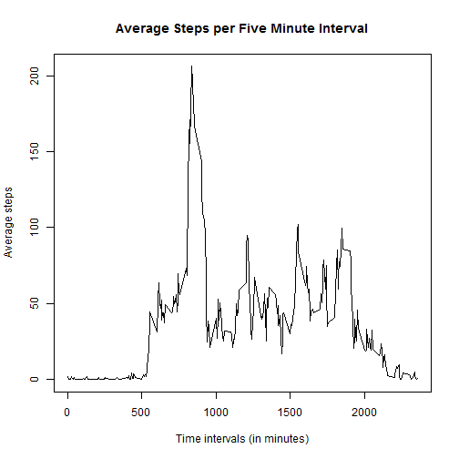
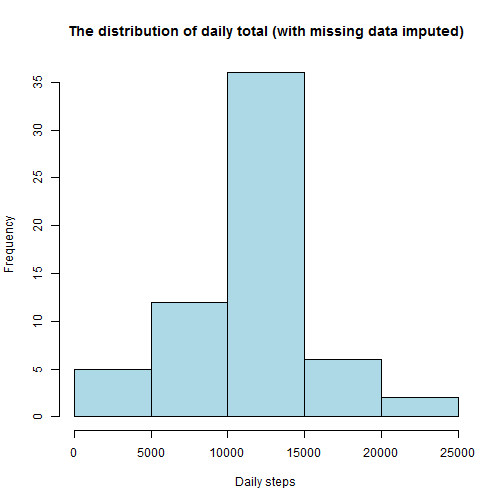
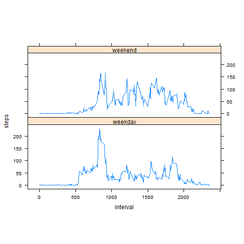

Basic Setting
==============
Make the code always visible

```r
echo = TRUE  
```

Loading and preprocessing the data
===================================
I use the read.csv() function to read in the designated csv file. 
I used the str() function to check the class types of the data.

```r
unzip("repdata-data-activity.zip")
rawdata <- read.csv("activity.csv")
str(rawdata)
```

```
## 'data.frame':	17568 obs. of  3 variables:
##  $ steps   : int  NA NA NA NA NA NA NA NA NA NA ...
##  $ date    : Factor w/ 61 levels "2012-10-01","2012-10-02",..: 1 1 1 1 1 1 1 1 1 1 ...
##  $ interval: int  0 5 10 15 20 25 30 35 40 45 ...
```

Since the class types are integer and factor so I change it to the proper class type.

```r
rawdata <- read.csv("activity.csv",colClasses=c("numeric","Date","numeric"))
str(rawdata)
```

```
## 'data.frame':	17568 obs. of  3 variables:
##  $ steps   : num  NA NA NA NA NA NA NA NA NA NA ...
##  $ date    : Date, format: "2012-10-01" "2012-10-01" ...
##  $ interval: num  0 5 10 15 20 25 30 35 40 45 ...
```

What is mean total number of steps taken per day?
==================================================
Instrucion: For this part of the assignment, you can ignore the missing values in the dataset. 

Generate a histogram of the total number of steps taken each day.

```r
data <- tapply(rawdata$steps, rawdata$date, FUN = sum, na.rm = TRUE)
hist(data,col="lightblue", main="Total Number of Steps Taken Per Day", xlab="Total steps by date", ylab="Frequency")
```

 

The mean and median of the total number of steps taken per day.


```r
mean(data)
```

```
## [1] 9354.23
```

```r
median(data)
```

```
## [1] 10395
```
What is the average daily activity pattern?
============================================
Make a time series plot (i.e. type = "l") of the 5-minute interval (x-axis) and the average number of steps taken, averaged across all days (y-axis).  
I aggregated the data on steps by the interval and took the mean. 

```r
average_steps <- aggregate(steps ~ interval, data=rawdata, mean, na.rm=TRUE)
plot(average_steps$interval, average_steps$steps, 
     type="l", 
     main="Average Steps per Five Minute Interval",
     xlab="Time intervals (in minutes)", 
     ylab="Average steps")
```

 

Which 5-minute interval, on average across all the days in the dataset, contains the maximum number of steps?

```r
maxsteps <- max(average_steps$steps)
maxsteps
```

```
## [1] 206.1698
```
Imputing missing values
========================
Calculate and report the total number of missing values in the dataset (i.e. the total number of rows with NAs)

```r
sum(is.na(rawdata))
```

```
## [1] 2304
```

If a 5-minute interval has missing value, I use the mean for that 5-minute interval. I created this two dataframe,  
nomissingvalue - Get rid of rows containing missing values and save the subset to a new data frame.  
filledinNA - Equal to the original dataset but with the missing data filled in. 


```r
filledinNA <- rawdata
nomissingvalue <- subset(rawdata, !is.na(rawdata$steps))

ndx <- is.na(filledinNA$steps)
int_avg <- tapply(nomissingvalue$steps, nomissingvalue$interval, mean, na.rm=TRUE, simplify=T)
filledinNA$steps[ndx] <- int_avg[as.character(filledinNA$interval[ndx])]
```
Make a histogram of the total number of steps taken each day and Calculate and report the mean and median total number of steps taken per day. 

```r
new <- tapply(filledinNA$steps, filledinNA$date, sum, na.rm=TRUE, simplify=T)

hist(x=new,
     col="lightblue",
     xlab="Daily steps",
     ylab="Frequency",
     main="The distribution of daily total (with missing data imputed)")
```

 

Do these values differ from the estimates from the first part of the assignment?  
Yes. The mean changed from 9354 to 10766. The median changed from 10395 to 10766.  

```r
mean(new)
```

```
## [1] 10766.19
```

```r
median(new)
```

```
## [1] 10766.19
```

What is the impact of imputing missing data on the estimates of the total daily number of steps?   

In the first histogram with the data frame that contained missing values, the data is skewed to the left although the data represents a normal distribution curve. In the second histogram (the data frame that had the missing values filled in), the data very closely resembles a normal distribution curve.


Are there differences in activity patterns between weekdays and weekends?
===========================================================================
Make a panel plot containing a time series plot (i.e. type = "l") of the 5-minute interval (x-axis) and the average number of steps taken, averaged across all weekday days or weekend days (y-axis). 


```r
filledinNA$date <- as.Date(filledinNA$date)
filledinNA$dayname <- weekdays(filledinNA$date)
filledinNA$weekend <- as.factor(ifelse(filledinNA$dayname == "Saturday" |
                                 filledinNA$dayname == "Sunday", "weekend", "weekday"))
library(lattice)
plotdata <- aggregate(steps ~ interval + weekend, filledinNA, mean)
xyplot(steps ~ interval | factor(weekend), data=plotdata, aspect=1/3, type="l")
```

 

Yes.The time plot shows that there is more activities after the 1000 time interval on the weekend compare to the weekday. Weekday activities arise mostly after 500 time interval and it's arise earlier than the weekends.  


